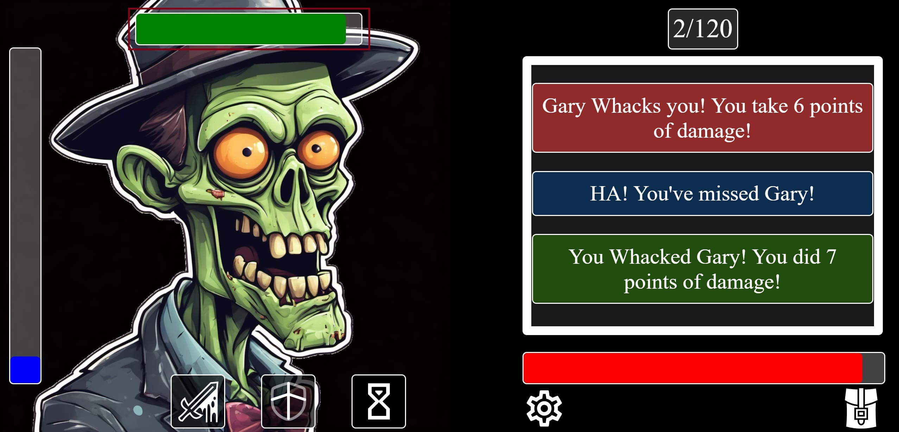
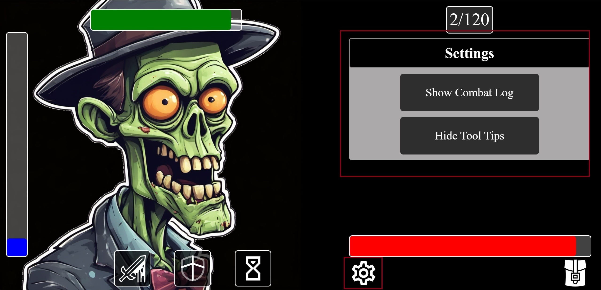
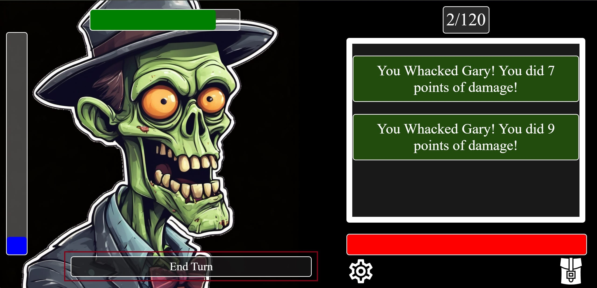
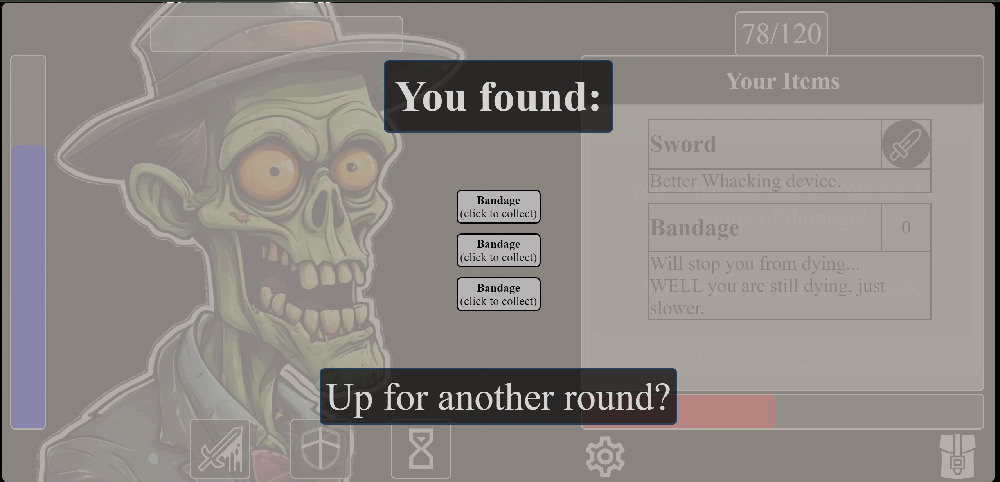

# **_Whack-a-Z_**

Whack-a-Z is a concept for a roguelike/rougelite game. Its main goal is to demonstrate the basic concepts of a game that can be easily expanded. To set a cornerstone for the combat system, noise level system, timer system and inventory system. Those core elements then can be further expanded which will be discussed in detail in [Planned Features](<#planned-features>).

You can find the deployed site at:
<a href="https://simonczedu.github.io/Whack-A-Z/" target="_blank" rel="noopener">Whack-a-Z</a>

Check it for yourself at:
<a href="https://ui.dev/amiresponsive?url=https://simonczedu.github.io/Whack-A-Z/" target="_blank" rel="noopener">Am I responsive</a>

# Contents

* [**User Experience UX**](<#user-experience-ux>)
    * [User Expectations](<#user-expectations>)
    * [Wireframes](<#wireframes>)
    * [Site Structure](<#site-structure>)
    * [Design Choices](<#design-choices>)
    * [Color Scheme](<#color-scheme>)
* [**Features**](<#features>)
    * [**Main Game Screen**](<#main-game-screen>)
    * [**Player Health Bar**](<#player-health-bar>)
    * [**Gary Health Bar**](<#gary-health-bar>)
    * [**Noise Level Indicator**](<#noise-level-indicator>)
    * [**Clock**](<#clock>)
    * [**Settings**](<#settings>)
        * [**Settings Options**](<#settings-options>)    
    * [**Combat Log**](<#combat-log>)
    * [**Inventory**](<#inventory>)
    * [**Actions**](<#actions>)
        * [**Attack**](<#attack>)  
        * [**Defend**](<#defend>)  
        * [**Wait**](<#wait>)
        * [**End Turn**](<#end-turn>) 
    * [**End Game**](<#end-game>) 
        * [**Search**](<#search>)
        * [**Replay**](<#replay>)
    * [**Tooltips**](<#tooltips>)
    * [**Planned Features**](<#planned-features>)
* [**Technologies Used**](<#technologies-used>)
* [**Testing**](<#testing>)
* [**Deployment**](<#deployment>)
* [**Credits**](<#credits>)
    * [**Content**](<#content>)
    * [**Media**](<#media>)
*  [**Acknowledgments**](<#acknowledgments>)

# User Experience (UX)

## User Expectations

 * As a user, I want to know the basic premise of a game
 * As a user, I want to have tooltips to better understand the UI
 * As a user, I want to have options to turn off some of the UI features
 * As a user, I want to have some kind of feedback to better understand the game
 * As a user, I want to be able to win and lose the game
 * As a user, when I win or lose I want to see feedback that the game ended
 * As a user, when the game ends I want to be able to restart it

[Back to top](<#contents>)

## Wireframes

The wireframes for Whack-a-Z were produced in [Balsamiq](https://balsamiq.com). Frames depict the first draft of the site concept look. Core concepts stayed the same for both the horizontal and vertical look of the site. Some changes occurred during development and were implemented on "as needed" basis.

[Wireframes in PDF (will open in new tab)](assets/image/readme-img/Whack-a-Z_wireframes.pdf)

[Back to top](<#contents>)

## Site Structure

This project is a single-page site. Hence there is no need for navigation. There was no need for a traditional header>main>footer as the site is modeled after the game UI. With the use of JavaScript, I was able to show and hide the content to the user (player) as needed. I also introduced a tooltip system based `onmousemove` that informs the player what UI elements are and what they intend to do.

[Back to top](<#contents>)

## Design Choices

 * ### General design philosophy
   
   * Whack-a-Z's first design choice is that it is a simple concept for a larger game. It is not meant to have all the features that I plan it to have. It is meant to work as a stand-alone turn-based combat system with a basic inventory system. It is meant as a showcase that such a game concept is not only feasible but also easily expandable. It is intended as a first building block and a showcase of my abilities to design and program a game system.
   
   * The second design choice is to keep the scope of the project small but plan for future designs as it is being developed. Those designs can be found in [Planned Features](<#planned-features>). Due to the smaller scope of the project, only a basic visual style is introduced. There is no font choice and only basic styling of the elements is introduced. The look of the game would be refined at the end of the development cycle of the whole game.
   
   * The third design choice is that it is meant to be satirical/humorous in design. At this stage, it will mainly manifest through the text and Gary's (the Zombie) design.
   
   * The fourth design choice is that the game is not supposed to tell the player what is going on EXACTLY. It is meant to present enough information through the tooltips and UI so that the player can play the game. But to understand it player needs to pay attention to the UI and combat log.
   
   * The fifth design choice is that there are 3 lose conditions and only one to win. 

  * ### Color Scheme

   * The color scheme was chosen and tested during development. It was not a focus of the project and is subject to change. The idea was to make the elements easily distinguishable and color-coded where needed. Most of that is visible in the combat log. Green color was used to show positive player actions (like successful hit), red for being hit by Gary, black for neutral when the player just waits, a blue for player misses (because you feel "blue" about it), and yellow when Gary missed. Gary's health bar is green, because zombie blood is green (according to games I have played anyway), the player health bar is red (because of course it is) and the noise level is color blue... for no particular reason and is subject to change.

[Back to top](<#contents>)

# Features
   
   ## Main Game Screen

   * As mentioned above Whack-a-Z is a single-page site. This page is the Main Game Screen (called index in the files). Inside that screen, some features are displayed throughout the whole game, and some are displayed with JavaScript when conditions for them to appear are met (i.e. Settings screen). Specific features will be listed below.
   
   * Here also welcome alert will be displayed on each site load (even a replay option).
   
[Back to top](<#contents>)
   
   
   ## Player Health Bar Features
   
   [Player Health Bar](assets/image/readme-img/pHealth.jpg)
   
   * This element represents the player's health level.
   
[Back to top](<#contents>)
   
   
   ## Gary Health Bar
   

   
   * This element represents Gary's (the zombie) health level.
   
[Back to top](<#contents>)
   
   
   ## Noise Level Indicator
   

   
   * This element represents the current noise level. If it reaches maximum before the win condition is met it will end the game with a message that the player was too loud. It is increased on every [Attack](<#attack>) by 4 on [Defend](<#defend>) by 1 and lowered on [Wait](<#wait>) by 3.
   
[Back to top](<#contents>)
   
   
   ## Clock
   

   
   * This element represents the current moves. If it reaches a maximum (120 currently) before the win condition is met it will end the game with a message that the player was too slow. It is increased on every [Attack](<#attack>), [Defend](<#defend>) and [Wait](<#wait>) by 1.
   
[Back to top](<#contents>)
   
   
   ## Settings
   

   
   * This element opens and closes the settings menu when pressed.
   
[Back to top](<#contents>)
   
   
   #### Settings Options

   * There are two options currently available:
    * Hide/Show Combat Log - which does exactly that on `click`.
    * Hide/Show Tooltips - same as above.
   
[Back to top](<#contents>)

   
   ## Combat Log

   * This element contains a message log of actions the player or Gary takes. The player can scroll through them and the newest is always at the top. They are color-coded (more information in [Color Scheme](<#color-scheme>)). It can be toggled on and off in [Settings](<#settings>).
   
[Back to top](<#contents>)

   
   ## Inventory

   * This element contains items that players can click on to use. Some items like a sword are equipable and some - like a bandage - are consumable. Players can see if a sword is equipped by the icon and they can tell how many bandages they have left from the number by its header. Using items DOES NOT use an action and DOES NOT increase player noise level.
   
[Back to top](<#contents>)

   
   ## Actions

   * This set of elements are actions that the player can take. They are listed and explained below.
   
[Back to top](<#contents>)
   
   
   #### Attack

   
   * This action runs a function that checks for random numbers for the so-called attack roll and damage roll. If the attack roll is high enough, the damage is applied to Gary's health bar (lowers it). In either case, using the attack will increase the player's noise level and will use one action (increases move).

[Back to top](<#contents>)

   
   #### Defend

   * This action sets players' status to defend. It can be selected only once per round (every 2 moves). When active next attack roll and damage roll of Gary's will be harder. This means it will have to be higher to hit and will always have less damage potential (can still roll up to 10 dmg though).
   
[Back to top](<#contents>)

   
   #### Wait

   * This action `skips` one move. It lowers the noise level instead of increasing it but does not roll for attack. It is meant as a way for a player to lower their noise level at the cost of wasting moves and still being exposed to Gary's attacks. Best utilized with defense action.
   
[Back to top](<#contents>)

   
   #### End Turn

   * This element is displayed after every two moves from the player (2x attack for example). When players press it Gary's turn is calculated. His hit and damage (if it was successful) are applied to the player's health and results are displayed in the combat log same as the player's actions. After this plays out, the default actions are restored and the player can carry out the next round.

[Back to top](<#contents>)

   ## End Game

   
   * This message is displayed if one of the 3 loos or 1 win conditions are met. Depending on the reason for this message to appear message will be adjusted - i.e. it will say that players were too loud if their noise level filled out before they could - ekhem - kill Gary.
   * With this message, players will have the option to start over or [search](#search) Gary. The latter will be only available if players manage to win. 

[Back to top](<#contents>)

   #### Replay

   * This option is part of the End Game screen. It simply reloads the page when clicked. This allows players to replay if they lost. It will be the only option available if the player loses. 
   
[Back to top](<#contents>)

   
   #### Search

   * This screen is displayed when players defeat Gary and choose to search his body for loot. Here, they will find a semi-random array of items that players won. This feature is just a taste of the loot system planned for future releases. More on it in [Planned Features](<#planned-features>)
   
[Back to top](<#contents>)

   
   ## Tooltips
   

   * This element appears when players taps or mouse over UI elements that require explanation. It can be toggled on and off in [Settings](<#settings>).

[Back to top](<#contents>)
   

 
## Planned Features 

[Back to top](<#contents>)

# Technologies Used

* [HTML5](https://html.spec.whatwg.org/) - basic content and structure for the website.
* [CSS](https://www.w3.org/Style/CSS/Overview.en.html) - styling.
* [JavaScript](https://www.javascript.com/) - site functionalities and interactive elements. 
* [Balsamiq](https://balsamiq.com/wireframes/) - concept wireframes.
* [Visual Studio Code](https://code.visualstudio.com/) - IDE used to develop, edit, commit and push the code to GitHub.
* [Github](https://github.com/) - used as a repository for the project and to deploy a public version of the Whack-a-Z.

[Back to top](<#contents>)

# Testing

Detailed [testing (opens in a new window)](TESTING.md) of Whack-a-Z.

[Back to top](<#contents>)

# Deployment

### **To deploy the project**

The site was deployed to GitHub pages. The steps to deploy a site are as follows:
  1. In the GitHub repository, navigate to the **Settings** tab.
  2. Once in Settings, navigate to the **Pages** tab on the left-hand side.
  3. Under **Source**, select the branch to **master**, then click **Save**.
  4. Once the master branch has been selected, the page will be automatically refreshed with a detailed ribbon display to indicate the successful deployment.

  The live link to the Github repository can be found here - https://simonczedu.github.io/Whack-A-Z/

### **To fork the repository on GitHub**

A copy of the GitHub Repository can be made by forking the GitHub account. This copy can be viewed and changes can be made to the copy without affecting the original repository. Take the following steps to fork the repository;
1. Log in to **GitHub** and locate the [repository](https://simonczedu.github.io/Whack-A-Z/).
2. On the right-hand side of the page in line with the repository name is a button called **'Fork'**, click on the button to create a copy of the original repository in your GitHub Account.

### **To create a local clone of this project**

Below is the method for cloning a project from GitHub:

1. Under the repository’s name, click on the **code** tab.
2. In the **Clone with HTTPS** section, click on the clipboard icon to copy the given URL.

3. In your IDE of choice, open **Git Bash**.
4. Change the current working directory to the location where you want the cloned directory to be made.
5. Type **git clone**, and then paste the URL copied from GitHub.
6. Press **enter** and the local clone will be created.

[Back to top](<#contents>)

# Credits
### Content & Media

[Back to top](<#contents>)

# Acknowledgments

The site was completed as a Portfolio 2 Project piece for the Full Stack Software Developer (e-Commerce) Diploma at the [Code Institute](https://codeinstitute.net/). As such I would like to thank my mentor [Precious Ijege](https://www.linkedin.com/in/precious-ijege-908a00168/), the Slack community, and all at the Code Institute for their help and support. 

Whack-a-Z is a concept of a game. The game I wish I can expand and flesh out in the future. I would like to thank Code Institute for the opportunity to take the first step on this journey.

I also would like to thank my wife Marta Furman for her help with the project and support. She tested the site, provided invaluable insight and inspired me every step. 

Szymon Czapiewski 2024.

[Back to top](<#contents>)