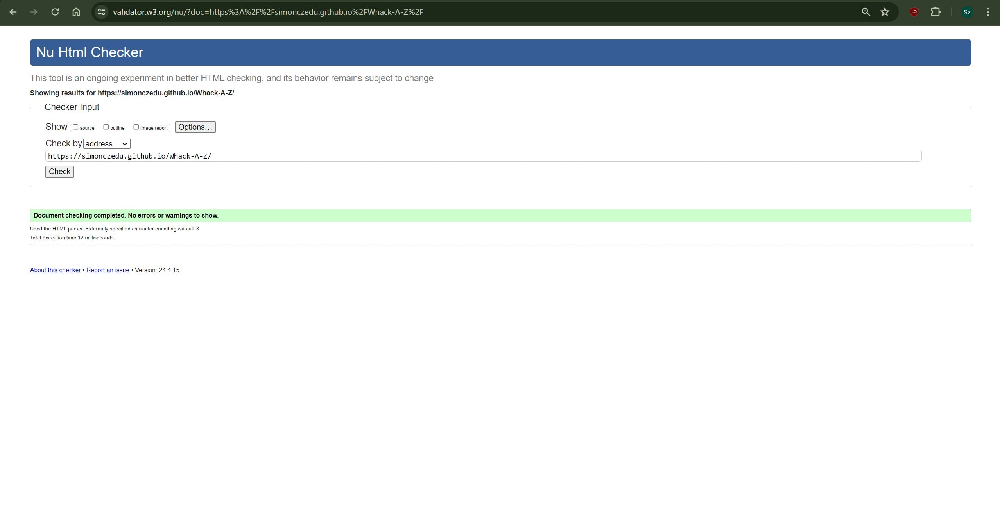
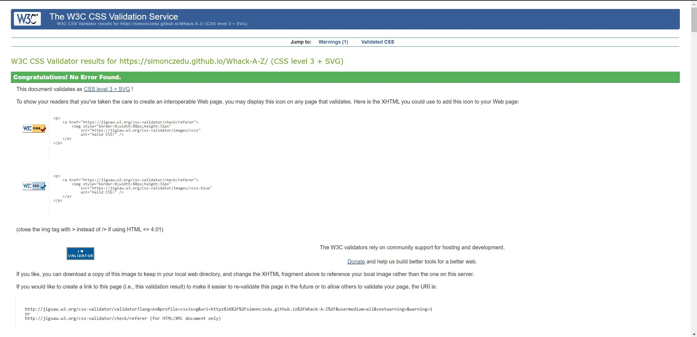
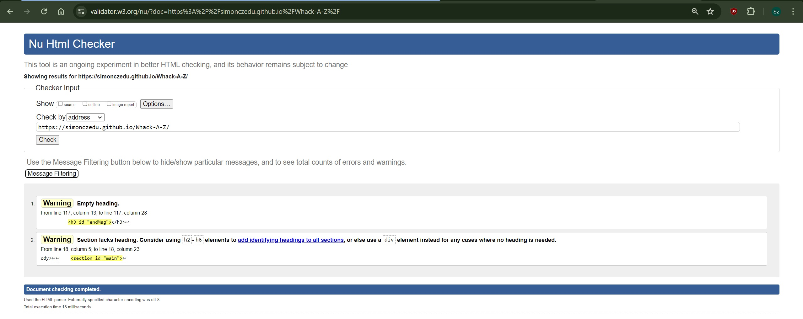
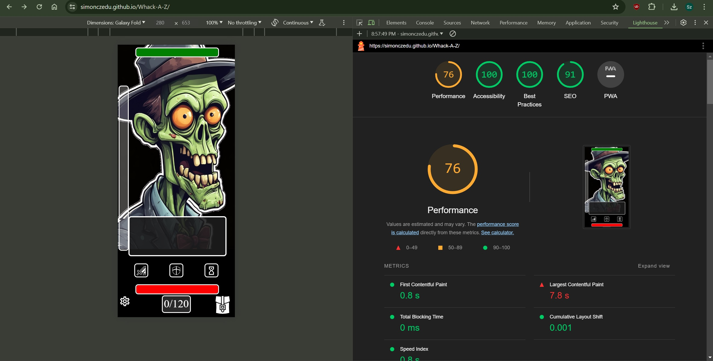

# Testing
## Code Validation
The Whack-a-Z site has be thoroughly tested. All the code has been run through the [W3C html Validator](https://validator.w3.org/) and the [W3C CSS Validator](https://jigsaw.w3.org/css-validator/). Minor errors were found on the all pages. After a fix and retest, no errors were returned for any of the pages tested. 

The HTML validator results for each page are below:

* Main Page

The CSS validator results are below:

## Responsiveness Test

* The responsive design tests were carried out manually with [Google Chrome DevTools](https://developer.chrome.com/docs/devtools/) and [Responsive Design Checker](https://www.responsivedesignchecker.com/checker.php?url=https%3A%2F%2Fsimonczedu.github.io%2FWhack-A-Z%2F&width=1920&height=1200).

|        | Moto G4 | Galaxy S5 | iPhone 5 | iPad | iPad Pro | Display <1200px | Display >1200px |
|--------|---------|-----------|----------|------|----------|-----------------|-----------------|
| Render | pass    | pass      | pass     | pass | pass     | pass            | pass            |
| Images | pass    | pass      | pass     | pass | pass     | pass            | pass            |
| Links  | pass    | pass      | pass     | pass | pass     | pass            | pass            |

## Testing if User Expectations were met:

* As a user, I want to know the basic premise of a game.
 * Alert message at the page load provides basics and suggests to view tooltips with hover or tap options.

* As a user, I want to have tooltips to better understand the UI.
 * Tooltips are present for every UI element. They are easily accessed by hovering over the UI element or by taping in on phones.

* As a user, I want to have options to turn off some of the UI features.
 * Settings allow to turn on and off tooltips AND combat log.

* As a user, I want to have some kind of feedback to better understand the game.
 * Combat log provides feedback on player actions and on Gary's turn to explain better what happened on each action. Ambiguity left is there by design, as I want players to discover best approach to the game.

* As a user, I want to be able to win and lose the game.
 * Condition for both winning and loosing are in place and tested that both options are viable. Though winning is hard without right strategy.

* As a user, when I win or lose I want to see feedback that the game ended.
 * End Game screen provides that information. It also adjusts to the reason for defeat conditions.

* As a user, when the game ends I want to be able to restart it.
 * There are two ways to continue playing. Either restarting the game (`Play again?` button), or searching Gary's body and starting new round where players left off. With timer, noise level and Gary's health reset. Though the player's health remains the same and new items are added to the player's inventory.

## Known Bugs

* ### Resolved

* Bug 01 - When setting up end Turn with event listener on #endTurn div that only exists IF player did 2 actions this error msg appeared:

 script.js:47 Uncaught TypeError: Cannot read properties of null (reading 'addEventListener')
 at script.js:47:35

 * Theory:
  * Suspecting I need to create endTurn div, but hide it with .style.display = 'none' instead. Will test now.
  
 * Test successful. Fixed.
	

* Bug 02 - When I tested 'end turn/zombie turn' I noticed that zombie was rolling for attack one time on first press, two on second, three on third ect. - resulting in more chances to hit player. Considered a bug as it is not initially intended behavior. However this creates interesting mechanic that will be considered a feature with tweaks to zombie hit chance and damage for the future iterations.

 * Theory:
  * Function nesting is causing the increase in how many times endTurn is called.

 * Solution:
  * I've broken down endTurn() into endTurnBtn() and zTurn(). zTurn() portion is no longer called on 'click' event. Instead it is called once after remainder is ===0. This means that zombie rolls attack only once per 2 player moves as originally intended.

* Bug 03 - Combat log is displaying only last action. This can lead to confusion as to what is happening. 

 * Theoretical solution: instead of simply logging:

 * "Message on hit
 document.getElementById(`combatLog`).innerHTML = `Zombie swings and hits! You take ${zAttackDmg} points of damage!`;"

 * I will append the combat log instead and make it so players can scroll through combat log.

* Bug 04 - When I tested game on my phone initial load had "actions" div out of place. 

 * Theory:
	Pushing from the bottom instead from the top (like the rest of the items with fixed positions) caused and issue. - tested. Conclusion: theory was wrong.

 * Solution:
 - Body was parent for all div. It's relative position could not be changed due to the background image depending on it. Instead I enclosed all dives in section #main. That solved the issue for the most part.
 - Fixed by changing how tooltips are displayed as it was expanding screen.

* ### Bugs found on validation

 * First error was fixed by adding `placeholder` inside the h3. This heading is edited by script
 * Second error was fixed by changing section to div.

* ### Unresolved

    * On my phone sometimes I can't scroll to the bottom of a page. Works on my wifes phone. Same manufacturer - different model. Might be cache issue, or browser/OS issue. It would be prime candidate for day one patch if players report it as a widespread bug on phones. Looks good in dev tools though.
	* Tooltip behavior - works on both phones and computer screens, but I had version with tooltip following cursor. It did not work for phones though. In future versions by using pointer: coarse check I can return to that concept and make inv and settings also close on tap out (without need for clicking specifically on their respective "buttons").

## Additional Testing
### Lighthouse
The site was also tested using [Google Lighthouse](https://developers.google.com/web/tools/lighthouse) in Chrome Developer Tools to test each of the pages for:
* Performance - How the page performs whilst loading.
* Accessibility - Is the site accessible for all users and how can it be improved.
* Best Practices - Site conforms to industry best practices.
* SEO - Search engine optimization. Is the site optimized for search engine result rankings.

As an example the results for Whack-a-Z Main Page are below:

* Conclusion: 
 * Biggest hit to the performance is the image of Gary. I used .png for it and it is flagged as a `future format`. Page on manual tests loads to satisfactory speed though, so for now this will be ignored.

### Peer review
In addition to the above testing the beta version of the site was put through its paces by peers, both in the software development field and outside. The bug with scrolling on phone screes has been reported. It since been addressed, but I will monitor further scrolling issues on phones. There were also minor spelling and grammar errors that have since been addressed.

Back to [README.md](./README.md#testing).